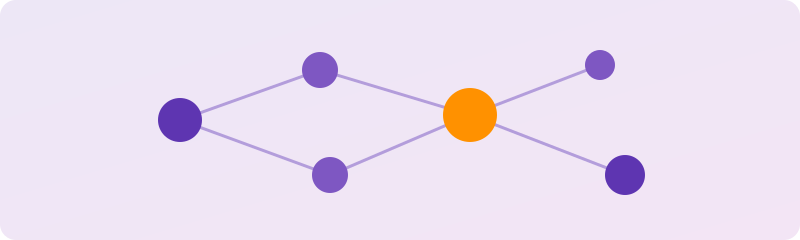

---
tags:
  - Õpioskused
---

# Kuidas õppida

<figure markdown="span">
  
</figure>

Enne kui hakkame käske, tööriistu ja mõisteid õppima, teeme selgeks kõige tähtsama tööriista — **sinu enda õppimise**.

See on lühike, visuaalne juhend: miks aju käitub nii nagu ta käitub, ja mida sa saad teha, et õppimine läheks kergemini ja jääks paremini külge.

!!! abstract "Mida sa siit saad"
    - tead, **miks** sa õpid (su suur idee)
    - saad aru, et ebamugavus alguses on normaalne
    - tunned ära oma õpistiili
    - kasutad kolme võtet, kuidas aju päriselt õpib
    - sead oma keskkonna nii, et see töötab sinu kasuks

## Mis siin on

1. **[Kuidas õppida](kuidas-oppida.md)** — miks aju käitub nii nagu ta käitub, ja viis põhitõde
2. **[Praktilised nipid](praktilised-nipid.md)** — mida teha, kui istud maha õppima
3. **[Kuidas konspekteerida](konspekteerimine.md)** — viis märkmemeetodit, millest üks sobib sulle
4. **[Tööriistad](tooriistad.md)** — varustus, mis teeb selle lihtsamaks
5. **[Töövihik](toovihik.md)** — täida enne, kui alustad, ja peegelda pärast
6. **[Allikad ja videod](allikad.md)** — uuringud ja videod, mis kõige selle taga on

[Alusta lugemist →](kuidas-oppida.md){ .md-button .md-button--primary }
