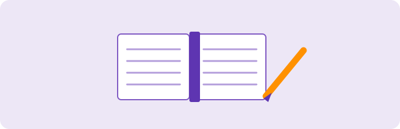
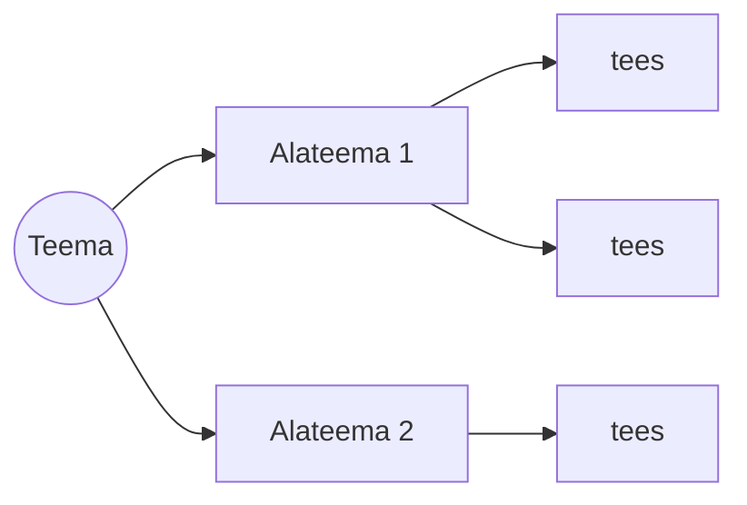

---
tags:
  - Õpioskused
---

# Kuidas konspekteerida

*Märkmete tegemine ei ole ümberkirjutamine — see on mõtlemine*

<figure markdown="span">
  
</figure>

---

## Õpiväljundid

Pärast seda oskad:

- selgitada, miks konspekt jääb paremini külge kui kuulamine
- valida endale sobiva märkmemeetodi
- teha märkmeid **oma sõnadega**, mitte sõna-sõnalt maha

---

## Miks üldse konspekteerida?

> **Miks see oluline on?**
> Kui sa ainult kuulad või loed, on aju passiivses režiimis — info voolab sisse ja kohe välja. Konspekt sunnib aju **tööle**.

Kolm kasu: sa ehitad endale isikliku teadmiste baasi, mille juurde saad hiljem tagasi tulla; info jääb tunduvalt paremini meelde; ja aju läheb passiivsest neelamisest üle aktiivsele töötlemisele — sa analüüsid, struktureerid ja mõtestad.

See seob otsa Loeng 0-ga: **oma sõnadega ümber sõnastamine on aktiivne meenutamine**. Sõna-sõnalt maha kirjutades sa ei õpi — sa oled koopiamasin.

---

## Vali endale meetod

### 1. Cornelli meetod

Jaga leht kolmeks: kitsas veerg vasakul (märksõnad ja küsimused), lai veerg paremal (põhikonspekt), riba all (kokkuvõte oma sõnadega).

```
┌────────────┬────────────────────────────┐
│ MÄRKSÕNAD  │  PÕHIKONSPEKT              │
│ küsimused  │  (kirjutad tunnis)          │
│            │                            │
│ (täidad    │  ........................   │
│  hiljem,   │  ........................   │
│  kui kordad)│  ........................  │
├────────────┴────────────────────────────┤
│ KOKKUVÕTE: 2–3 lauset OMA sõnadega       │
└──────────────────────────────────────────┘
```
*Pilt: Cornelli leht — vasak veerg ja kokkuvõte täidad hiljem, ja seegi on juba kordamine*

### 2. Skeemimeetod (outline)

Üks suur nummerdatud/taandega nimekiri: teema → alateema → tees. Kiire ja loomulik käsurea- ja koodiinimesele.

```
• Teema
   • Alateema
      • tees 1
      • tees 2
• Teema
   • Alateema
      • ...
```

### 3. Mõttekaart (mind map)

Keskel põhiidee, sellest hargnevad harud. Hea ajurünnakuks ja seoste nägemiseks.


*Pilt: mõttekaart — üks juur, harud seostega*

### 4. Lausemeetod

Iga uus mõte uuele reale ja nummerda. Kui mõte seostub varasemaga, kirjuta juurde number (nt "vt 1"). Nii tekivad seosed ka lineaarses konspektis.

### 5. Voomeetod (flow)

Kõige vabam: kuluta materjali mahakirjutamisele **minimaalselt** aega, mõtle ise kaasa ja pane kirja oma kommentaarid ja ideed. Tulemus võib olla skeem, laused, mõttekaart — või kõik korraga.

---

## Kaks nippi kõigile

- Kasuta **erinevaid värve** — aitab hiljem õiget kohta leida.
- Kasuta **ühesuguseid lühendeid** läbi kogu konspekti.

### ✅ Kontrolli ennast
Milline neist viiest meetodist sobiks sinu järgmisele tunnile?

---

*Nüüd tead, kuidas märkmeid teha. Vali tööriistad → [Tööriistad](tooriistad.md)*
