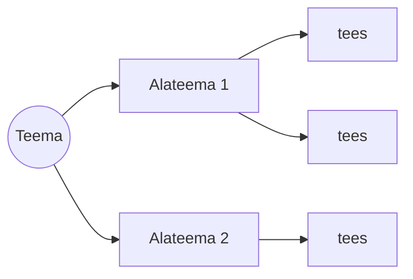

---
tags:
  - Õpioskused
---

# Kuidas konspekteerida

*Märkmete tegemine ei ole ümberkirjutamine, vaid mõtlemine*

<figure markdown="span">
  
</figure>

---

## Õpiväljundid

Pärast selle materjali läbimist oskad:

- selgitada, miks konspekteerimine kinnistab teadmise paremini kui pelk kuulamine
- valida endale sobiva märkmemeetodi
- teha märkmeid oma sõnadega, mitte sõna-sõnalt ümber kirjutades

---

## Miks konspekteerida

Kui üksnes kuulad või loed, on aju passiivses seisundis ja info kaob sama kiiresti, kui tuli. Konspekteerimine sunnib aju infot aktiivselt töötlema.

Sellel on kolm kasu: sa lood endale isikliku teadmiste kogu, mille juurde saad hiljem naasta; info jääb märksa paremini meelde; ja aju liigub passiivselt vastuvõtmiselt aktiivsele töötlusele — sa analüüsid, struktureerid ja mõtestad materjali.

See seostub eelmise teemaga: **oma sõnadega ümbersõnastamine on aktiivne meenutamine**. Sõna-sõnalt ümberkirjutamine ei ole õppimine.

---

## Vali endale meetod

### 1. Cornelli meetod

Jaga leht kolmeks: kitsas veerg vasakul (märksõnad ja küsimused), lai veerg paremal (põhikonspekt) ja riba all (kokkuvõte oma sõnadega).

```
┌────────────┬────────────────────────────┐
│ MÄRKSÕNAD  │  PÕHIKONSPEKT              │
│ küsimused  │  (kirjutad tunnis)          │
│            │                            │
│ (täidad    │  ........................   │
│  hiljem,   │  ........................   │
│  kui kordad)│  ........................  │
├────────────┴────────────────────────────┤
│ KOKKUVÕTE: 2–3 lauset OMA sõnadega       │
└──────────────────────────────────────────┘
```
*Pilt: Cornelli leht — vasaku veeru ja kokkuvõtte täidad hiljem, mis ühtlasi on juba kordamine*

### 2. Skeemimeetod (outline)

Üks nummerdatud või taandega nimekiri: teema → alateema → tees. Kiire ja loomulik neile, kes on harjunud käsurea või koodi struktuuriga.

```
• Teema
   • Alateema
      • tees 1
      • tees 2
• Teema
   • Alateema
      • ...
```

### 3. Mõttekaart

Keskel põhiidee, millest hargnevad harud. Sobib ideede kogumiseks ja seoste nägemiseks.


*Pilt: mõttekaart — üks juur ja seostatud harud*

### 4. Lausemeetod

Iga uus mõte algab uuel real ja on nummerdatud. Kui mõte seostub varasemaga, lisa viide (nt "vt 1"). Nii tekivad seosed ka lineaarses konspektis.

### 5. Voomeetod (flow)

Kõige vabam meetod: kuluta materjali ümberkirjutamisele võimalikult vähe aega, mõtle ise kaasa ning pane kirja omaenda kommentaarid ja ideed. Tulemuseks võib olla skeem, laused, mõttekaart või nende kombinatsioon.

---

## Kaks üldist soovitust

- Kasuta erinevaid värve — see aitab hiljem vajaliku koha kiiresti üles leida.
- Kasuta läbivalt samu lühendeid.

**Kontrolli ennast.** Milline neist viiest meetodist sobiks sinu järgmisele tunnile?

---

*Nüüd tead, kuidas märkmeid teha. Vali sobivad vahendid → [Tööriistad](tooriistad.md)*
