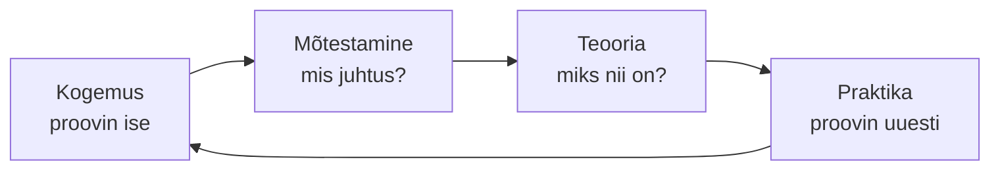

---
tags:
  - Õpioskused
---

# Loeng 0 — Kuidas õppida

*Lühike visuaalne juhend: kuidas kutsekooli aastad enda kasuks pöörata*

<figure markdown="span">
  
</figure>

---

## Õpiväljundid

Pärast seda oskad:

- nimetada oma **suure idee** — miks sa üldse õpid
- selgitada, miks ebamugavus alguses on normaalne, mitte läbikukkumine
- ära tunda oma õpistiili (Kolbi ring)
- kasutada kolme võtet, kuidas aju päriselt õpib
- seada oma keskkond nii, et õppimine läheb kergemini

---

## 1. Kõigepealt: miks sa siin oled?

> **Miks see oluline on?**
> Motivatsioon ei ole nupp, mida vajutad ja hakkad õppima. Rasketel päevadel hoiab sind vee peal hoopis üks konkreetne põhjus — sinu **suur idee**.

Keegi ei õpi selleks, et lihtsalt "programm läbida ja paber kätte saada". Iga õppimise taga on soov midagi muuta: saada amet, mis meeldib, teenida oma raha, teha asju, mille üle uhkust tunda.

!!! question "Kirjuta üks lause vihikusse"
    Kelleks sa tahad kahe aasta pärast saada? Mis see sulle annab?

Kui aju hakkab virisema "ei viitsi", tuletad selle lause meelde. See on su ankur.

---

## 2. Ebamugavus on osa mängust

> **Miks see oluline on?**
> Uus kool, uus rühm, uus õpetaja, uus süsteem — su aju paneb muutustele vastu. Ärevus alguses ei tähenda, et sa oled vales kohas.

Esimestel nädalatel võib tunduda, et kõik teised saavad aru ja ainult sina mitte. Tegelikult mõtleb sedasama pool rühma. Reegel on lihtne: **karta tohib, teha ka.**

Mida rohkem sa õpid, seda vähem sa õpetajat vajad. See on normaalne areng, mitte midagi kaugelt saavutamatut:

```
Sõltuv  →  Huvitatud  →  Kaasatud  →  Iseseisev
õpetaja                               sina juhid,
juhib sammhaaval                      õpetaja aitab vajadusel
```
*Pilt: alguses toetud õpetajale, lõpuks õpid ise — iseseisvus ongi eesmärk*

### ✅ Kontrolli ennast
Millal viimati tundus miski hirmus, aga sa tegid ära ja said hakkama?

---

## 3. Igal kangelasel on oma tee

> **Miks see oluline on?**
> Ei ole üht õiget viisi õppida. Kui tead, kuidas *sina* kõige paremini õpid, lõpetad enda pideva võrdlemise teistega.

Õppimine käib ringina (David Kolbi mudel): teed kogemuse, mõtestad, seod teooriaga, proovid uuesti. Alustada võib igast punktist.


*Pilt: Kolbi õpiring — õppimine ei ole sirge joon, vaid ring*

Enamik meist eelistab üht sisenemiskohta:

| Tüüp | Alustab sellest, et... |
|------|------------------------|
| **Aktivist** | hüppab kohe tegema, õpib katse-eksituse teel |
| **Mõtleja** | vaatab enne pealt, mõtleb, siis teeb |
| **Teoreetik** | loeb kõigepealt, kuidas asi töötab |
| **Pragmaatik** | proovib kohe päris ülesande peal, kas töötab |

Ükski pole parem. Enamik on segu. Tunned end kellegi ära?

!!! warning "Oluline: õpistiil ei ole vabandus"
    "Õpistiil" ütleb, kust sul on **mugav alustada** — mitte seda, et sa õpiksid ainult ühtviisi. Uuringud näitavad selgelt, et õpetuse sobitamine kellegi "stiiliga" (visuaal/audio/kinesteetik) tulemusi ei paranda; ka siinsed neli tüüpi on **enesetundmise tööriist, mitte täppisteadus**. Mis töötab kõigil ühtemoodi, on **meenutamine ja kordamine**. Vaata [Allikad](allikad.md).

---

## 4. Kuidas aju päriselt õpib

> **Miks see oluline on?**
> Kolm võtet, mis säästavad tunde. Kõik kolm tunduvad ebamugavamad kui tavaline "loen konspekti üle" — ja just seepärast nad töötavad.

**1. Meenuta, ära üleloe (active recall).** Kui loed sama teksti viiendat korda, tekib tunne "oskan" — aga see on tuttavuse pettus, mis eksamiks kaob. Meenutamine hoiab teadmise üleval.

<figure markdown="span">
  
  <figcaption>Sama aeg, kaks meetodit — meenutamine hoiab teadmise üleval, ülelugemine laseb tal vajuda</figcaption>
</figure>

Sulge ekraan ja proovi käsk **peast**, alles siis vaata spikrist. Kui eksisid — hea, just seal oli auk.

**2. Jaota ajas (spacing).** Neli korda 20 minutit üle nädala lööb iga kord ühte pikka õhtut. Iga kordamine ütleb ajule: *seda hoia alles.*

<figure markdown="span">
  
  <figcaption>Sama aeg kokku — jaotatuna jääb see palju paremini meelde</figcaption>
</figure>

**3. Raske = sa õpid.** Kui käib kergelt, siis kordad juba osatavat. Kodutööd tee nagu pilt laeb netis — **progressive JPEG**:

<figure markdown="span">
  
  <figcaption>Kõigepealt midagi, mis töötab; alles siis ilus. Ära jää esimese detaili taha kinni.</figcaption>
</figure>

### ✅ Kontrolli ennast
Millist kolmest sa täna veel EI kasuta?

---

## 5. Sea keskkond enda poolele

> **Miks see oluline on?**
> Tahtejõud saab otsa. Keskkond ei saa. Lihtsam on ruum korra korda teha kui iga päev endaga võidelda.

- **Steriilne kabiin.** Lennukis tohib startides rääkida ainult lennust. Tee endale õppimise ajaks sama: üks asi korraga, muu ootab.
- **Telefon teise tuppa.** Nii kaugele, et selle järele peab püsti tõusma. Nähtav telefon sööb keskendumist isegi tummalt.
- **Leia õpipaariline (bädi).** Kui seletad kaaslasele, saad ise paremini aru — seda nimetatakse peer-to-peer õppimiseks. Ja küsi julgelt: küsimus ei tee sind lolliks, vastuseta jäämine küll.
- **Kodused liitlased.** Ütle kodus välja, mis kell sa õpid ja et siis sind ei segataks.

Meie moto: **teen koostööd, mitte ei võitle** — ei õpetaja, kaaslaste ega iseendaga.

### ✅ Kontrolli ennast
Mis on sinu suurim segaja? Kuidas teed selle järgmisel õppekorral raskemini kättesaadavaks?

---

## 6. Kokkuvõte

### Kuidas õppida — ühe pilguga

| Võte | Tuum |
|------|------|
| **Suur idee** | tea, miks sa õpid |
| **Ebamugavus = OK** | karta tohib, teha ka |
| **Oma tee** | tunne oma õpistiili |
| **Meenuta** | sulge materjal, tuleta ise |
| **Jaota ajas** | vähehaaval > üks öö |
| **Raske = õpin** | progressive JPEG |
| **Keskkond** | telefon eemale, bädi kõrvale |

### 🎯 Peegeldus (tee iga labori lõpus)

Hinda ennast skaalal 1–5:

1. Sain aru, mida ma täna tegin ja miks.
2. Tean, mis jäi segaseks ja mida ma järgmisena küsin.

Ja üks emotsioon: mis tundega sa täna lahkud?

---

*Vali siit üks võte ja proovi seda kohe järgmises laboris — õppimist õpib ainult õppides. 🚀*
