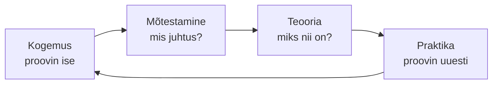
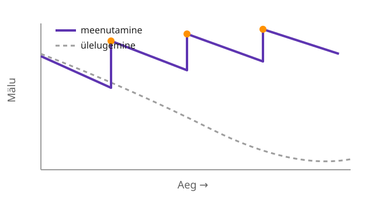
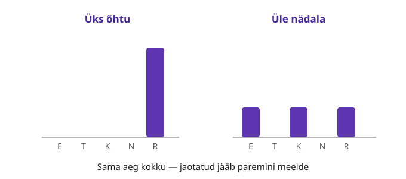
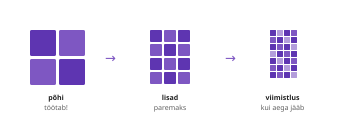

---
tags:
  - Õpioskused
---

# Kuidas õppida

*Kuidas aju uut infot töötleb ja kuidas seda enda kasuks pöörata*

<figure markdown="span">
  
</figure>

---

## Õpiväljundid

Pärast selle materjali läbimist oskad:

- sõnastada, miks sa õpid, ja hoida seda eesmärki silme ees
- selgitada, miks õppimise alguse ebamugavus on ootuspärane
- tunda ära oma eelistatud õpiviisi, pidamata seda ainuvõimalikuks
- kasutada kolme tõhusat õpivõtet
- kujundada keskkonna, mis toetab keskendumist

---

## 1. Miks sa õpid

Motivatsioon ei ole nupp, mille vajutamisel õppimine iseenesest käivitub. Rasketel hetkedel hoiab sind edasi liikumas pigem selge eesmärk kui hetkeline tahtmine.

Õppimise taga on tavaliselt soov midagi saavutada: omandada eriala, teenida oma sissetulek või teha tööd, mille üle tunned uhkust. Kui sõnastad selle eesmärgi enda jaoks, on hiljem lihtsam edasi minna ka siis, kui motivatsioon raugeb.

!!! question "Pane kirja"
    Kelleks tahad kahe aasta pärast saada ja mida see sulle annab?

---

## 2. Alguse ebamugavus on ootuspärane

Uus kool, uus rühm, uus õpetaja ja uus töökorraldus panevad aju kohanema, ning mööduv ärevus õppimise alguses on täiesti tavaline. See ei tähenda, et oled vales kohas.

Sageli tundub, et teised saavad kõigest aru ja ainult sina mitte. Tegelikult mõtleb sedasama suur osa rühmast.

Mida rohkem sa õpid, seda iseseisvamaks muutud. Tegemist on loomuliku arenguga, mitte kaugelt saavutamatu eesmärgiga:

```
Sõltuv  →  Huvitatud  →  Kaasatud  →  Iseseisev
õpetaja                               sina juhid,
juhib sammhaaval                      õpetaja toetab vajadusel
```
*Pilt: alguses toetud õpetajale, lõpuks õpid iseseisvalt — iseseisvus on eesmärk*

**Kontrolli ennast.** Millal viimati tundus mõni ülesanne hirmutav, kuid said sellega hakkama?

---

## 3. Igal õppijal on oma tee

Õppimiseks ei ole ühte ainuõiget viisi. Kui tead, kuidas ise kõige paremini õpid, ei pea end pidevalt teistega võrdlema.

Õppimist võib kirjeldada ringina (David Kolbi mudel): teed kogemuse, mõtestad seda, seod teooriaga ja proovid uuesti. Alustada võib ükskõik millisest punktist.


*Pilt: Kolbi õpiring — õppimine ei ole sirge joon, vaid ring*

Enamik õppijaid eelistab alustada ühest kindlast punktist:

| Tüüp | Eelistab alustada sellest, et... |
|------|----------------------------------|
| **Aktivist** | asub kohe tegema ja õpib katsetades |
| **Mõtleja** | vaatleb esmalt kõrvalt, kaalub ja alles siis tegutseb |
| **Teoreetik** | selgitab kõigepealt välja, kuidas asi toimib |
| **Pragmaatik** | katsetab kohe päris ülesande peal, kas lahendus töötab |

Ükski neist ei ole parem kui teine ja enamik inimesi on nende segu.

!!! warning "Õpistiil ei ole vabandus"
    Eelistatud õpiviis näitab, kust on mugav alustada, mitte seda, et peaksid õppima ainult ühel viisil. Uuringute põhjal ei paranda õpetuse sobitamine kellegi "stiiliga" (visuaalne, auditiivne, kinesteetiline) õpitulemusi; ka siinsed neli tüüpi on pigem enesetundmise tööriist kui täppisteadus. Kõigil toimivad ühtviisi meenutamine ja kordamine. Vt [Allikad](allikad.md).

---

## 4. Kuidas aju päriselt õpib

Järgnevad kolm võtet säästavad õppimiseks kuluvat aega. Kõik kolm tunduvad ebamugavamad kui teksti korduv ülelugemine — ja just seetõttu need toimivad.

**1. Meenuta, ära üleloe (active recall).** Kui loed sama teksti mitmendat korda, tekib tunne, et oskad seda. See tunne on aga petlik ja kaob eksamiks. Enda testimine — materjali sulgemine ja mälust taastamine — kinnistab teadmise palju kindlamalt.

<figure markdown="span">
  
  <figcaption>Sama aeg, kaks meetodit — meenutamine hoiab teadmise üleval, ülelugemine laseb sel vajuda</figcaption>
</figure>

Proovi käsku esmalt peast ja alles seejärel kontrolli. Kui eksid, oledki leidnud koha, mis vajab kordamist.

**2. Jaota õppimine ajas (spacing).** Sama koguse aja jaotamine mitmele päevale annab parema tulemuse kui kõige tegemine ühe õhtuga. Iga kordamine annab ajule märku, et tegu on olulise infoga.

<figure markdown="span">
  
  <figcaption>Sama aeg kokku — jaotatuna jääb teadmine märksa paremini meelde</figcaption>
</figure>

**3. Jõukohane raskus tähendab õppimist.** Kui õppimine tundub liiga kerge, kordad tõenäoliselt juba teadaolevat. Kodutööd tehes alusta lihtsast toimivast lahendusest ja viimistle alles siis, kui aega jääb — sarnaselt pildile, mis laadides järk-järgult teravneb.

<figure markdown="span">
  
  <figcaption>Kõigepealt toimiv põhi, seejärel viimistlus — ära jää esimese detaili taha kinni</figcaption>
</figure>

**Kontrolli ennast.** Millist neist kolmest võttest sa veel ei kasuta?

---

## 5. Kujunda keskkond enda kasuks

Tahtejõud ammendub, keskkond aga püsib. Lihtsam on korrastada ruum üks kord kui iga päev iseendaga võidelda.

- **Selge tööala.** Tegele õppimise ajal ühe asjaga korraga; ülejäänu ootab.
- **Telefon eemale.** Pane see teise ruumi, nii et selleni jõudmiseks peaksid püsti tõusma. Nähtaval telefon vähendab keskendumist ka siis, kui sa seda ei puuduta.
- **Õpipaariline.** Kaaslasele seletades saad ise materjalist paremini aru (nn peer-to-peer õppimine). Küsi julgelt — küsimata jäänud küsimus takistab rohkem kui küsitud.
- **Toetav kodu.** Lepi lähedastega kokku, millal sa õpid ja et sind siis ei segataks.

**Kontrolli ennast.** Mis on sinu suurim segaja ja kuidas muudad selle järgmisel korral raskemini kättesaadavaks?

---

## Kokkuvõte

| Põhimõte | Tuum |
|----------|------|
| **Selge eesmärk** | tea, miks sa õpid |
| **Alguse ebamugavus on normaalne** | ärevus möödub, kui edasi teed |
| **Oma tee** | tunne oma eelistatud õpiviisi |
| **Meenutamine** | sulge materjal ja taasta mälust |
| **Jaotatud kordamine** | vähehaaval on parem kui üks õhtu |
| **Jõukohane raskus** | alusta lihtsast toimivast lahendusest |
| **Keskkond** | telefon eemale, õpipaariline kõrvale |

**Refleksioon (tee iga suurema teema või labori järel).** Hinda skaalal 1–5, kuivõrd said aru, mida ja miks tegid, ning pane kirja, mis jäi segaseks ja mida kavatsed järgmisena küsida.

---

*Vali üks võte ja rakenda seda juba järgmisel õppekorral — õppima õpib ainult õppides.*
